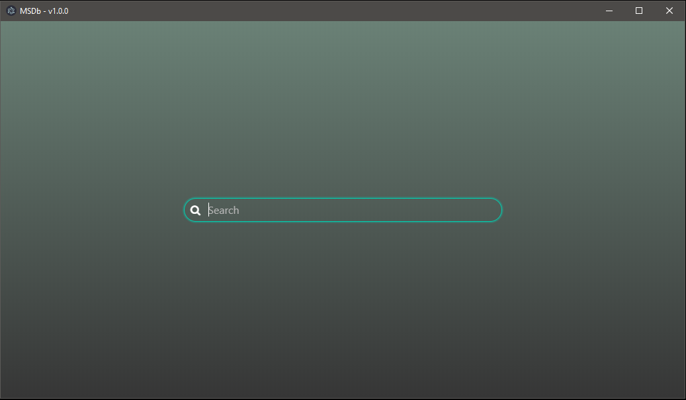

# MSDb
Movie search application via IMDb using [Electron](https://github.com/electron/electron) and [Vue](https://github.com/vuejs/vue).

---

## Installation 
```bash
$ git clone https://github.com/burak-olmez/MSDb.git
$ cd MSDb
$ npm install
$ npm run electron:serve
```

---

## Screenshots



---

## Lisance
The MIT License (MIT)